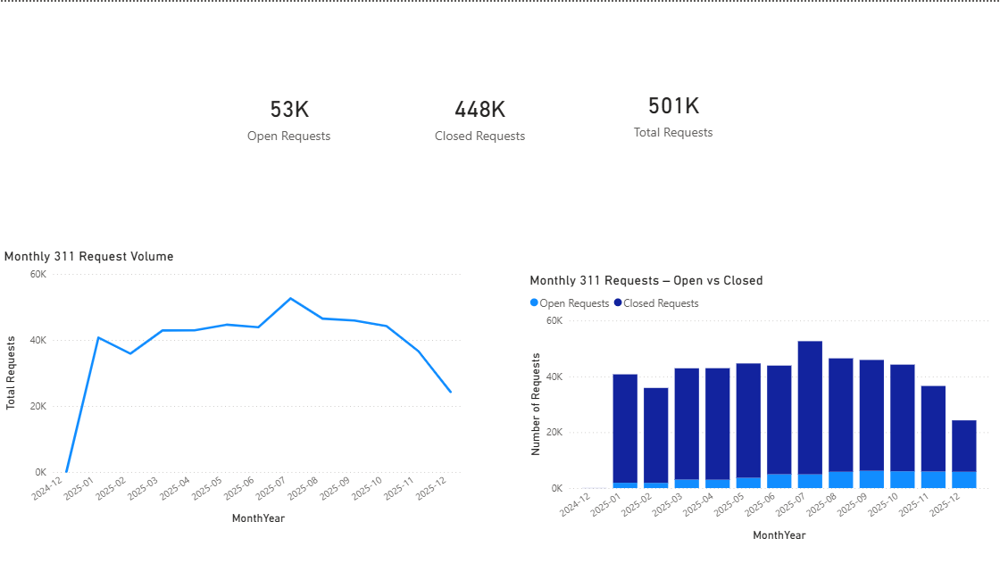

# Philadelphia 311 Data Analytics — SQL & Power BI

## Project Summary
End-to-end data analytics project using Philadelphia 311 open data.  
The project focuses on data cleaning, quality validation, and operational analysis using PostgreSQL, with insights presented in a Power BI dashboard.

This work demonstrates real-world data analyst skills: SQL data preparation, quality checks, time-based analysis, and executive-level reporting.

---

## Business Questions Answered
- How many 311 requests are submitted each month?
- How does request volume change over time?
- How many requests are Open vs Closed?
- What is the current backlog of open requests?
- How long does it take to close requests, on average and at the median?
- What percentage of requests are closed within 7, 14, and 30 days?

---

## Tools & Technologies
- **PostgreSQL** — data cleaning, views, aggregations, data quality checks  
- **Power BI** — data modeling, KPIs, trend analysis, dashboards  

---

## SQL Work (PostgreSQL)

**Data Preparation**
- Created an analytics-ready view ('vw_phl311_clean') from raw 311 data
- Standardized text fields and normalized request status values
- Handled missing and invalid values

**Data Quality Checks**
- Validated missing and duplicate request IDs
- Checked “Unknown” classifications
- Verified full date coverage

**Analysis**
- Monthly request volume trends
- Open vs Closed request analysis
- Current backlog identification
- Resolution time analysis (average, median, SLA-style thresholds)

All SQL scripts are available in the 'sql/' folder.

---

## Power BI Dashboard

### KPIs
- **Total Requests**
- **Open Requests (Backlog)**
- **Closed Requests**

### Visuals
- Monthly 311 Request Volume (trend)
- Monthly Open vs Closed Requests

> **Note:** The Power BI (.pbix) file is not included due to GitHub file size limits.  
> It is available upon request.

---

## Key Insights
- Request volume shows consistent monthly patterns
- A steady backlog of open requests exists across months
- Resolution times vary significantly by service type
- Most requests are resolved within defined time thresholds

---

## Why This Project Matters
This project mirrors real data analyst work:
- Cleaning messy, real-world data
- Validating data quality before analysis
- Answering operational business questions
- Communicating insights clearly through dashboards

---

## How to Run
1. Load Philadelphia 311 data into PostgreSQL
2. Run SQL scripts in order (01 → 05)
3. Connect Power BI to PostgreSQL and load 'vw_phl311_clean'
4. Refresh visuals
